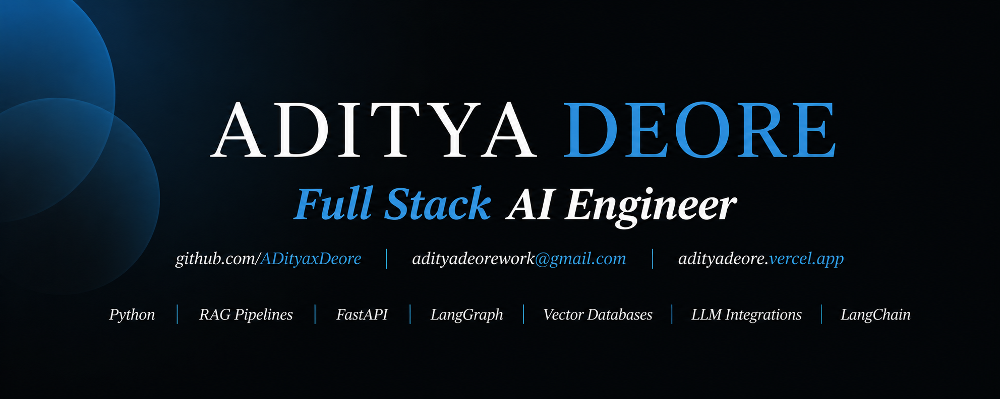

  

 

  

 

   
  
    

## Professional Experience

* **Associate Software Engineer** | ITSA | Pune, India | Hybrid | May 2025 - Jan 2026

 

* **Artificial Intelligence Intern** | Personify Health | Remote | Mar 2025 - May 2025

## Core Focus Areas
* **AI & Machine Learning:** Architecting autonomous agents, structured LLM integration pipelines, predictive analytics systems, and clinical image classification models.

 

* **Full-Stack Engineering:** Developing responsive web applications, secure REST APIs, clean database schemas, and highly functional dashboard interfaces.

 

* **Product Execution:** Transitioning ideas into deployment-ready tools with an emphasis on performance, robust architecture, and clear user experiences.

 

 

  <h2>Featured Projects</h2>
  
Selected work across AI, learning platforms, healthcare ML, and creative tooling.

  <table width="100%" border="0" cellspacing="15">
    <tr>
      <td width="50%" align="center" style="border: 2px solid #1f6feb; border-radius: 12px; padding: 20px; background-color: #0d1117; vertical-align: top;">
        <h3><a href="https://github.com/AdityaxDeore/Code-Campus" style="color:#58A6FF; text-decoration:none;">Code Campus</a></h3>
        
AI-powered coding learning platform with guided hints and step-by-step explanations.

        
        
      </td>
      <td width="50%" align="center" style="border: 2px solid #1f6feb; border-radius: 12px; padding: 20px; background-color: #0d1117; vertical-align: top;">
        <h3><a href="https://github.com/AdityaxDeore/Clarity-Mental-Health-AI-assistance" style="color:#58A6FF; text-decoration:none;">Clarity</a></h3>
        
Digital mental-health platform with AI wellness support, mood tracking, and student-focused resources.

        
        
      </td>
    </tr>
    <tr>
      <td width="50%" align="center" style="border: 2px solid #1f6feb; border-radius: 12px; padding: 20px; background-color: #0d1117; vertical-align: top;">
        <h3><a href="https://github.com/AdityaxDeore/brain-tumor-detection" style="color:#58A6FF; text-decoration:none;">Brain Tumor Detection</a></h3>
        
Machine-learning project for brain tumor detection and classification using medical imaging data.

        
        
      </td>
      <td width="50%" align="center" style="border: 2px solid #1f6feb; border-radius: 12px; padding: 20px; background-color: #0d1117; vertical-align: top;">
        <h3><a href="https://github.com/AdityaxDeore/obamify" style="color:#58A6FF; text-decoration:none;">Obamify</a></h3>
        
Creative image transformation tool that turns any image into an Obama-inspired result.

        
        
      </td>
    </tr>
  </table>

 

 

  <h2>Contribution History</h2>
  
  
  
    

  Private contributions appear when enabled in GitHub settings.

 

 

  <h2>Technologies & Tools</h2>
  
  <table width="100%" border="0" cellspacing="15">
    <tr>
      <td width="50%" align="center" style="border: 2px solid #1f6feb; border-radius: 12px; padding: 20px; background-color: #0d1117; vertical-align: top;">
        <h3>Programming Languages</h3>
         
        
      </td>
      <td width="50%" align="center" style="border: 2px solid #1f6feb; border-radius: 12px; padding: 20px; background-color: #0d1117; vertical-align: top;">
        <h3>Frameworks & Libraries</h3>
         
        
      </td>
    </tr>
    <tr>
      <td width="50%" align="center" style="border: 2px solid #1f6feb; border-radius: 12px; padding: 20px; background-color: #0d1117; vertical-align: top;">
        <h3>Databases</h3>
         
        
      </td>
      <td width="50%" align="center" style="border: 2px solid #1f6feb; border-radius: 12px; padding: 20px; background-color: #0d1117; vertical-align: top;">
        <h3>Tools & Platforms</h3>
         
        
      </td>
    </tr>
  </table>

   
  
  <table width="100%" border="0" cellspacing="15">
    <tr>
      <td align="center" style="border: 2px solid #1f6feb; border-radius: 12px; padding: 20px; background-color: #0d1117;">
        <h3>Soft Skills</h3>
         
        
        
        
        
        
      </td>
    </tr>
  </table>

